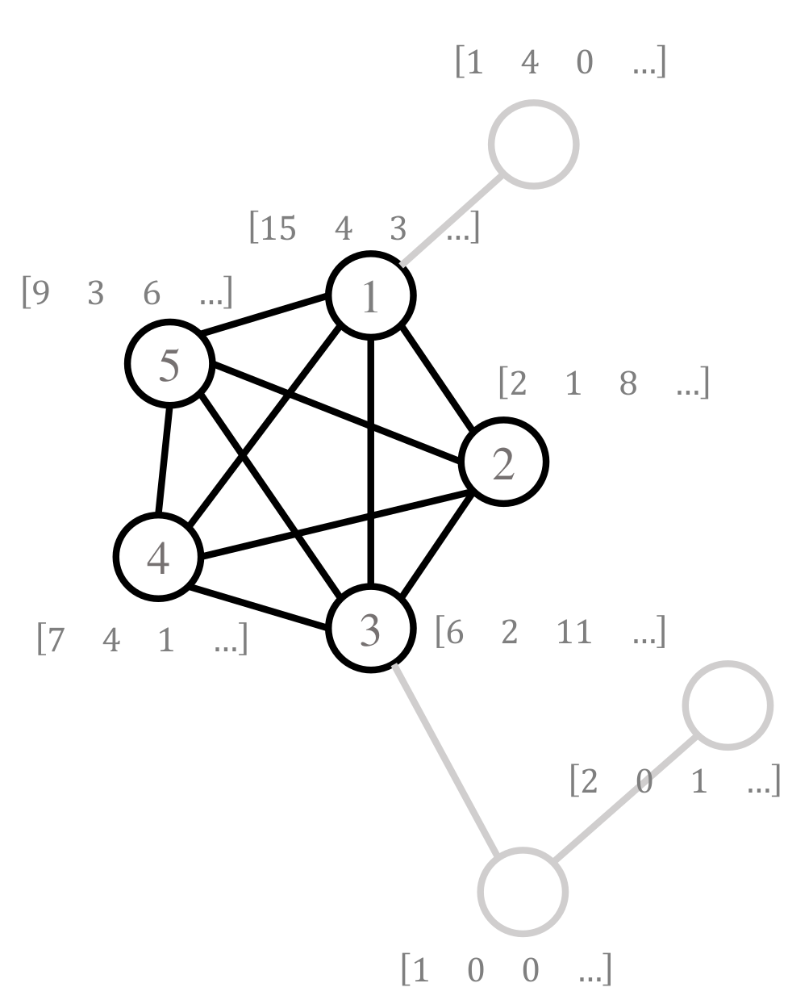

# Simulation & Perturbation of EMOGI
In order to assess which of the input data is important for EMOGIs classifications, we eused simulations and perturbation
experiments. Simulations make use of [NetSim](https://github.com/schulter/NetSim) to simulate artificial networks with
biological characteristics (power-law node degree distribution and the like) and implant graph motifs in those networks.
This way, the performance of EMOGI recovering these graph modules can be evaluated.

## Simulation
[This notebook](EMOGI_preprocessing_NetSim_modules.ipynb) computes a HDF5 container with random feature vectors for the nodes
following different gaussian distributions. The values in the graph motifs get values from one distribution while the rest
gets values from the other one. The closer those two distributions are, the harder it becomes to classify based on features
alone and the graph structure becomes more important.

Below is an example of a clique implanted in a random network:

## Perturbation
[This notebook](EMOGI_perturbation_setup.ipynb) uses an existing HDF5 container designed for EMOGI training and perturbs features, network and both. It finally writes the perturbed data back to a container that can be used for EMOGI training.
### Feature Perturbations
Features are perturbed by swapping feature vectors of nodes. The algorithm will simply exchange feature vectors of two randomly chosen nodes. It will try `max_tries` many times to swap two nodes and fail when those have already been swapped. Therefore, it can be (especially when `max_tries` is small) that the final amount of swaps is considerably lower than the percentage given.
Additionally, random feature vectors from a standard gaussian are assigned, denoting completely randomized feature vectors.

### Network Perturbations
This perturbation performs a [double edge swap](https://networkx.github.io/documentation/networkx-1.9/reference/generated/networkx.algorithms.swap.double_edge_swap.html) for the requested number of edges. This way, the node degree of all nodes stays the same. Furthermore, two different random networks are generated. One [preserves the node degree](https://networkx.github.io/documentation/networkx-1.10/reference/generated/networkx.generators.degree_seq.expected_degree_graph.html#networkx.generators.degree_seq.expected_degree_graph) while the other [does not](https://networkx.github.io/documentation/networkx-1.10/reference/generated/networkx.generators.random_graphs.powerlaw_cluster_graph.html), making it possible to assess the importance of node degree in EMOGI classifications.

### Network & Feature Perturbations
Here, perturbations of both, network and features are used. Usually, both data types are perturbed to the same amount (50%, 100% and random).
